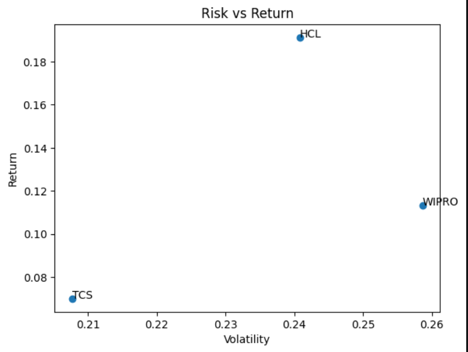
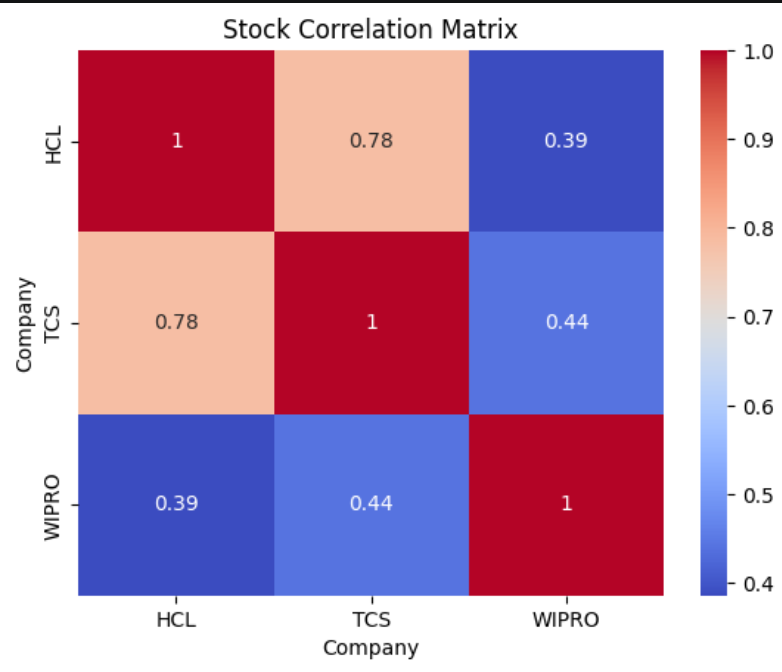
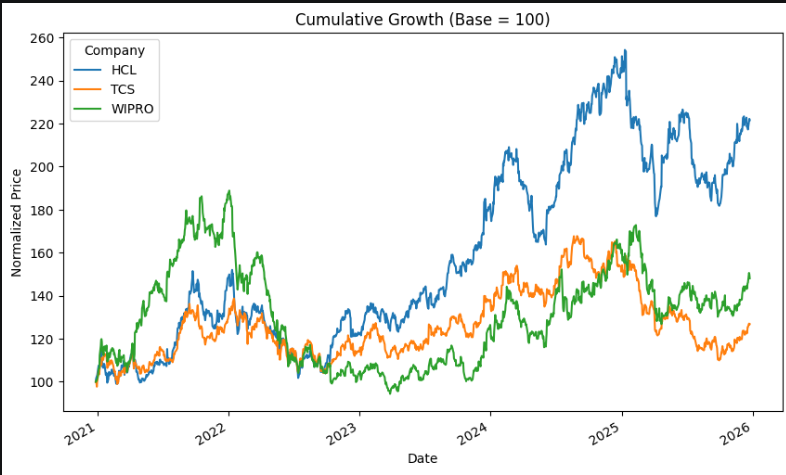
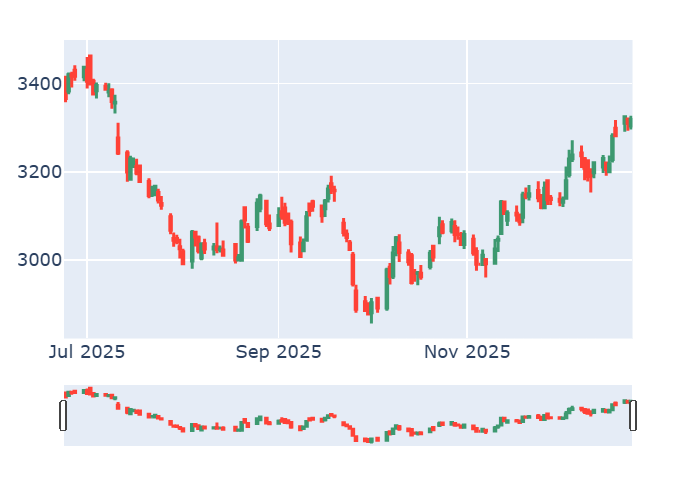

## Historical Stock Price and Volatility Analysis
<small>
Analyzing historical stock performance, volatility, and risk-adjusted returns of major Indian IT companies using Python and SQL.
</small>

## Project Overview

This project performs historical stock price analysis and volatility analysis on major Indian IT companies including Infosys, TCS, Wipro, and HCLTech using Python, SQL, and data visualization techniques.

The project focuses on:

* Historical stock trend analysis
* Daily return calculation
* Volatility analysis
* Risk vs Return comparison
* Correlation analysis
* Candlestick visualization

---

## Technologies Used

* Python
* Pandas
* NumPy
* Matplotlib
* Seaborn
* Plotly
* MySQL
* Jupyter Notebook

---

## Dataset

The dataset contains 5 years of historical stock data for:

* INFY
* TCS
* WIPRO
* HCLTECH

Columns used:

* Open
* High
* Low
* Close
* Volume
* Date

---

## Financial Metrics Used

### Daily Return

R_t = \frac{P_t - P_{t-1}}{P_{t-1}}

### Annualized Volatility

\sigma = \sqrt{252} \times Std(R_t)

### Sharpe Ratio (Risk-Adjusted Return)

Sharpe = \frac{Return}{Volatility}

---

## Features Implemented

* Data Cleaning and Preprocessing
* Daily Return Calculation
* Volatility Analysis
* Moving Average Analysis
* Candlestick Charts
* Risk vs Return Scatter Plot
* Correlation Heatmap
* Multi-Stock Comparative Analysis

---

## Project Workflow

Data Collection → Data Cleaning → Feature Engineering → Statistical Analysis → Visualization → Risk Analysis

---

## Key Findings / Insights

### ➤ Key Trends

* Infosys demonstrated strong long-term growth with favorable risk-adjusted returns
* TCS showed relatively stable volatility over the selected period
* IT sector stocks displayed strong positive correlation in price movements

---

### ➤ Important Patterns

#### 🔹 Risk vs Return Analysis

* Stocks with higher volatility generally showed higher return potential
* Infosys provided a balanced risk-return profile compared to peers

#### 🔹 Correlation Heatmap

* Strong correlation observed among IT sector companies
* Similar market trends affected most stocks simultaneously

#### 🔹 Volatility Analysis

* Wipro and HCLTech experienced comparatively higher short-term fluctuations
* TCS maintained relatively stable movement during volatile periods

---

### ➤ Business / Financial Insights

* Volatility acts as a major indicator of investment risk
* Risk-adjusted analysis helps investors identify stable long-term opportunities
* Correlation analysis assists in portfolio diversification decisions

---

### ➤ Data-Driven Conclusions

* Stocks with lower volatility tend to offer more stable returns
* IT sector companies generally move in similar market cycles
* Risk-return comparison is useful for identifying efficient investment choices


---

## Sample Visualizations

### Risk vs Return Analysis



### Correlation Heatmap



### Cumulative Growth



### Candlestick Visualization



---
Project Structure
HISTORICAL_STOCK_DATA/
│
├── data/
│   ├── HCLTECH_5y.csv
│   ├── INFY_5y.csv
│   ├── TCS_5y.csv
│   └── WIPRO_5y.csv
│
├── notebooks/
│   └── stock_analysis.ipynb
│
├── presentation/
│   └── Presentation.pptx
│
├── sql/
│   └── Master_stocks.sql
│
├── images/
│   ├── risk_return_plot.png
│   ├── correlation_heatmap.png
│   ├── cumulative_growth.png
│   └── candlestick_chart.png
│
├── README.md
└── requirements.txt

## How to Run

1. Clone the repository

```bash
git clone <your-github-link>
```

2. Install dependencies

```bash
pip install -r requirements.txt
```

3. Open Jupyter Notebook

```bash
jupyter notebook
```

4. Run:

* notebooks/stock_analysis.ipynb

---

## Future Improvements

* Real-time stock API integration
* Portfolio diversification analysis
* Rolling volatility analysis
* Additional sector-wise stock comparison

---

## Conclusion

This project successfully analyzed historical stock performance and volatility of major Indian IT companies using statistical and visualization techniques. The analysis highlighted differences in risk, return, and market behavior among stocks, helping identify relatively stable and high-performing investment options.

---

## Author

Reema Gupta